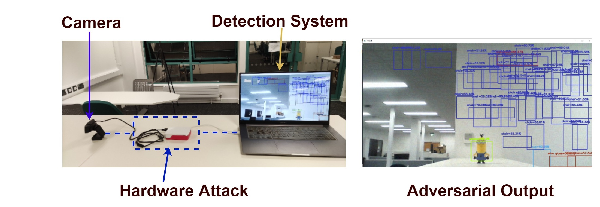

## Man-in-the-Middle Attack against Object Detection

> This project uses a Raspberry Pi 4 to fool the object detection system in real-time.

[[ Talk ]](https://minm.wuhanstudio.uk) [[ Video ]](https://youtu.be/OvIpe-R3ZS8) [[ Paper ]](https://arxiv.org/abs/2208.07174) [[ Code ]](https://github.com/wuhanstudio/adversarial-camera)

We use a Raspberry Pi 4 to eavesdrop and manipulate the video stream transferred over the USB cable.


The linux program that injects the perturbation and simulates a virtual USB camera can be found here: [uvc-gadget](https://github.com/wuhanstudio/adversarial-camera/tree/master/hardware/buildroot-external-raspi4/package/uvc-gadget/src).



The Man-in-the-Middle Attack consists of two steps:

- Step 1: [Generating the perturbation](detection/README.md).
- Step 2: [Deploying the perturbation](hardware/README.md).


### Quick Start

We’ve released pre-built images for Raspberry Pi 4 that can be flashed to microSD cards:

- For development: **raspbian_minm_attack.img**
- For release: **buildroot_minm_attack.img**

Checkout the [latest release](https://github.com/wuhanstudio/adversarial-camera/releases).

<br />

## WHite-box Adversarial Toolbox (WHAT)

<!-- [](https://circleci.com/gh/wuhanstudio/whitebox-adversarial-toolbox) -->
[](https://app.travis-ci.com/wuhanstudio/whitebox-adversarial-toolbox)
[](https://badge.fury.io/py/whitebox-adversarial-toolbox)
[](https://opensource.org/licenses/MIT)
[](https://pypi.org/project/whitebox-adversarial-toolbox/)
[](https://what.wuhanstudio.uk/)

Alternatively, you can try real-time white-box attacks using our toolbox.

### Installation

```python
pip install whitebox-adversarial-toolbox
```

<a href="https://github.com/wuhanstudio/whitebox-adversarial-toolbox"></a>

### Usage (CLI)

```
Usage: what [OPTIONS] COMMAND [ARGS]...

  The CLI tool for WHitebox-box Adversarial Toolbox (what).

Options:
  --help  Show this message and exit.

Commands:
  attack   Manage Attacks
  example  Manage Examples
  model    Manage Deep Learning Models
```
