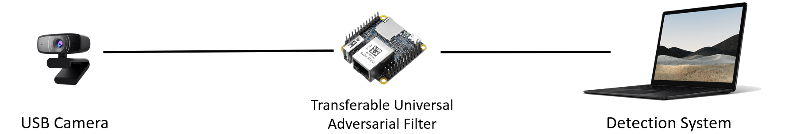
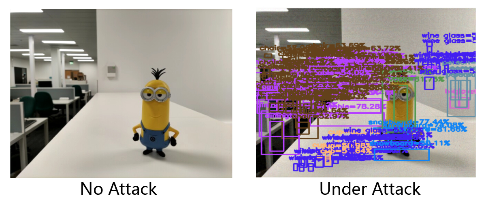

## Adversarial Camera

An adversarial USB camera that fools Deep Learning models for object detection.




Editing the `/boot/cmdline.txt` to enable the OTG mode:

```
modules-load=dwc2,libcomposite
```

And add an extra line at the end of `/boot/config.txt`

```
dtoverlay=dwc2
```

We also need to enable the v4l2loopback kernel module for a v4l2 dummy device by adding this to `/etc/modules`:

```
v4l2loopback
libcomposite
```

Now you are ready to use this project:

```
# Clone to home directory /home/pi
$ git clone https://github.com/wuhanstudio/adversarial-camera & cd adversarial-camera
$ sudo cp piwebcam.service /etc/systemd/system/
$ sudo systemctl enable piwebcam
$ cd src && make
```

```
# gst-launch-1.0 videotestsrc ! v4l2sink device=/dev/video0
# sudo ffmpeg -f v4l2 -input_format yuyv422 -i /dev/video40  -c:v mjpeg  -f mjpeg - > /dev/video42
# gst-launch-1.0 videotestsrc ! "video/x-raw, width=640, height=360, fps=30/1" ! avenc_mjpeg !  v4l2sink device=/dev/video42
```


If everything works fine, after rebooting you should see:

```
pi@raspberrypi:~ $ v4l2-ctl --list-device
fe980000.usb (gadget):
        /dev/video1

bcm2835-codec-decode (platform:bcm2835-codec):
        /dev/video10
        /dev/video11
        /dev/video12
        /dev/video18

bcm2835-isp (platform:bcm2835-isp):
        /dev/video13
        /dev/video14
        /dev/video15
        /dev/video16

Dummy video device (0x0000) (platform:v4l2loopback-000):
        /dev/video0
```

Now you can fake a USB camera:

```
$ ./start.sh
$ sudo ./src/uvc-gadget -f 0 -r 1 -u /dev/video1 -v /dev/video0
```

## uvc-gadget

**Upstream project [uvc-gadget](http://git.ideasonboard.org/uvc-gadget.git) has been updated and continuous maintenance**

UVC gadget userspace enhancement sample application

Fork from  
[uvc-gadget.git](http://git.ideasonboard.org/uvc-gadget.git)  
Apply enhancement Bhupesh Sharma's patchset  
[UVC gadget test application enhancements](https://www.spinics.net/lists/linux-usb/msg84376.html)  
and Robert Baldyga's patchset  
[Bugfixes for UVC gadget test application](https://www.spinics.net/lists/linux-usb/msg99220.html)  

## How to use

    Usage: ./uvc-gadget [options]
    
    Available options are
        -b             Use bulk mode
        -d             Do not use any real V4L2 capture device
        -f <format>    Select frame format
                0 = V4L2_PIX_FMT_YUYV
                1 = V4L2_PIX_FMT_MJPEG
        -h             Print this help screen and exit
        -i image       MJPEG image
        -m             Streaming mult for ISOC (b/w 0 and 2)
        -n             Number of Video buffers (b/w 2 and 32)
        -o <IO method> Select UVC IO method:
                0 = MMAP
                1 = USER_PTR
        -r <resolution> Select frame resolution:
                0 = 360p, VGA (640x360)
                1 = 720p, WXGA (1280x720)
        -s <speed>     Select USB bus speed (b/w 0 and 2)
                0 = Full Speed (FS)
                1 = High Speed (HS)
                2 = Super Speed (SS)
        -t             Streaming burst (b/w 0 and 15)
        -u device      UVC Video Output device
        -v device      V4L2 Video Capture device

## Change log

- Apply patchset [Bugfixes for UVC gadget test application](https://www.spinics.net/lists/linux-usb/msg99220.html)  

- Apply patchset [UVC gadget test application enhancements](https://www.spinics.net/lists/linux-usb/msg84376.html)  

- Add Readme/.gitignore and documentations  
  Copy linux-3.18.y/drivers/usb/gadget/function/uvc.h into repository, change include path for build
