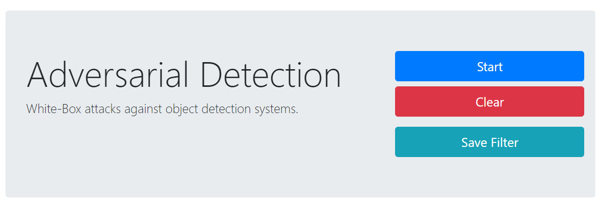

## Adversarial Detection

> Step1: Generating the perturbation (Universal Adversarial Perturbation)




### Quick Start

You may use [anaconda](https://www.continuum.io/downloads) or [miniconda](https://conda.io/miniconda.html). 

```
$ # CPU
$ conda env create -f environment.yml
$ conda activate adversarial-camera

$ # GPU
$ conda env create -f environment_gpu.yml
$ conda activate adversarial-gpu-camera

$ python detect.py --model model/yolov3-tiny.h5 --class_name coco_classes.txt
```

The web page will be available at: http://localhost:9090/

That's it! The perturbation is saved as `noise.npy` file in the folder `noise`.


### White-box Adversarial Toolbox

Alternatively, you can generate the UAP using the [WHite-box Adversarial Toolbox (WHAT)](https://github.com/wuhanstudio/whitebox-adversarial-toolbox).


### Step 2: Deploying the Perturbation

You can use a raspberry pi 4 to deploy the perturbation ([documentation](../hardware/README.md)).
