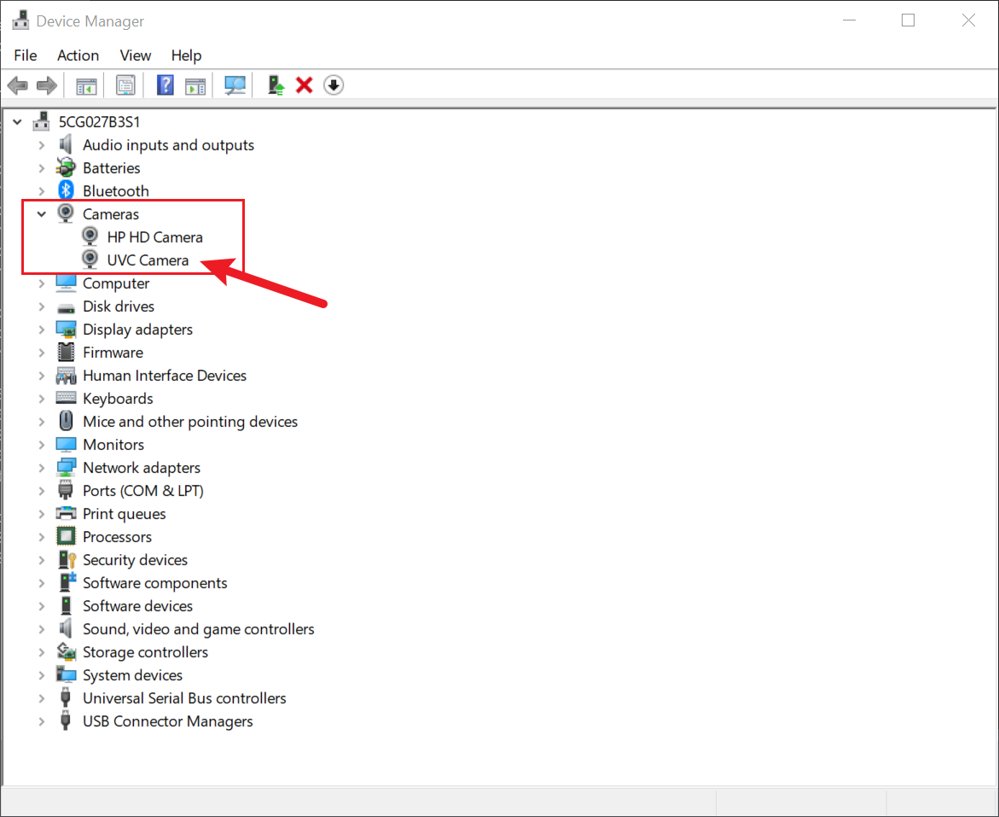

# Step 2: Deploying the perturbation (Rasbian)

**Important: Please use this version of Raspi OS: [2021-10-30-raspios-bullseye-armhf.img](https://downloads.raspberrypi.org/raspios_armhf/images/raspios_armhf-2021-11-08/)**

For the latest version of Raspi OS, there is a known issue related to the UVC gadget driver of the Linux Kernel:

```
UVC: Possible USB shutdown requested from Host, seen during VIDIOC_DQBUF
select timeout
UVC: Stopping video stream.
```

### 1. Set up the Raspi OS

Editing the `/boot/cmdline.txt` to enable the USB device mode:

```
modules-load=dwc2,libcomposite
```

And add an extra line at the end of `/boot/config.txt`

```
dtoverlay=dwc2
```


### 2: Compile the program

Now you are ready to compile the program:

```
# Install Dependencies
$ sudo apt update
$ sudo apt install build-essential libopencv-dev libjpeg-dev

# Clone the repo
$ git clone https://github.com/wuhanstudio/adversarial-camera
$ cd adversarial-camera/hardware/rasbian

# Enable the configuration as a service
$ sudo cp systemd/piwebcam.service systemd/piwebcam /etc/systemd/system/
$ sudo cp piwebcam -r /etc/
$ sudo systemctl enable piwebcam

# Compile the program
$ cd uvc-gadget && make
```

If everything works fine,  **reboot** the system with a USB camera plugged in. You should see several video devices:

```
pi@raspberrypi:~ $ v4l2-ctl --list-device
fe980000.usb (gadget):
        /dev/video2

USB2.0 PC CAMERA: USB2.0 PC CAM (usb-0000:01:00.0-1.4):
        /dev/video0
        /dev/video1
```

Now you can fake a USB camera without adding the perturbation:

```
$ sudo ./uvc-gadget -u /dev/video2 -v /dev/video0 -f 1 -r 1
```

To add the perturbation:

```
$ sudo ./uvc-gadget -u /dev/video2 -v /dev/video0 -f 1 -r 1 -n path/to/noise.npy
```

If the raspberry pi is connected to a Windows PC, you should see a new camera device from the device manager.

**Cheers!**


